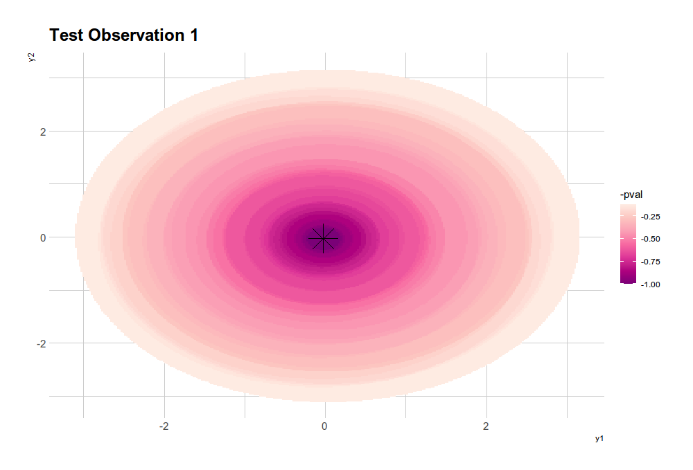

# Conformal Inference Prediction Regions for Multivariate Response Regression

<div align="center">
  
</div>

<br><br>

Welcome to the **Conformal Inference Prediction Regions for Multivariate Response Regression** package! This repository provides a Python implementation of a robust and versatile tool for constructing valid prediction regions at levels \(1-lpha\) or \(1-2lpha\) in **multivariate response regression**. The package extends the widely used **Conformal Prediction** methods to handle **multivariate response data**, accommodating a wide range of data distributions without relying on Gaussian assumptions.

Originally developed as part of a **Master’s thesis in Mathematical Engineering** at Politecnico di Milano, this package empowers analysts and researchers to make accurate predictions across diverse datasets while embracing the flexibility of a **non-parametric approach**.

---

## Key Features

- **Handles Multivariate Response Regression**: Extends conformal prediction methods to multivariate data.
- **Distribution-Free**: No assumptions of Gaussian data, making it suitable for diverse real-world scenarios.
- **Customizable and Modular**: Separates regression methods from prediction methods for enhanced flexibility.
- **Visualization Support**: Includes functions for plotting and interpreting prediction regions.

---

## Code Structure

The package is structured into distinct function families to streamline the workflow:

1. **Prediction Methods**  
   Compute valid prediction regions using different conformal inference approaches.

2. **Regression Methods**  
   Use built-in regression techniques or integrate your own models. Supported methods include linear regression, ridge, lasso, and elastic net.

3. **Plotting Methods**  
   Visualize prediction regions and model outputs with specialized plotting functions.

This modular design provides maximum flexibility, allowing you to tailor the package to your specific regression analysis needs.

---

## Key Functions

The package provides a rich set of functions to enable and enhance regression analysis. Here are the core functions:

<div align="center">

| Function          | Description                                             |
|-------------------|---------------------------------------------------------|
| `conformal_multi_full` | Computes Full Conformal prediction regions             |
| `conformal_multi_split` | Computes Split Conformal prediction regions            |
| `conformal_multi_msplit` | Computes Multi-Split Conformal prediction regions      |
| `get_prediction_model` | Creates and retrieves regression models for prediction |
| `plot_multi_full` | Visualizes Full Conformal prediction as scatter plots  |
| `plot_multi_full_contour` | Visualizes Full Conformal prediction as contour plots  |
| `plot_multi_split` | Custom visualizations for Split Conformal predictions  |
| `plot_multi_msplit` | Plots Multi-Split Conformal prediction regions         |

</div>

---

## How to Use

1. **Install the Package**  
   Clone this repository and install the package using:
   ```bash
   pip install .
   ```

2. **Import and Configure**  
   Import the package and use its functions for your analysis:
   ```python
   from conformal_inference import conformal_multidim_full, plot_multidim_full_scatter
   ```

3. **Compute Prediction Regions**  
   Fit your regression model, then use the conformal methods to compute prediction regions:
   ```python
   prediction_region = conformal_multidim_full(model, X_train, Y_train, X_test, alpha=0.1)
   ```

4. **Visualize Results**  
   Use the plotting functions to explore your prediction regions:
   ```python
   plot_multidim_full_scatter(prediction_region)
   ```

---

## Theoretical Insights

For a comprehensive understanding of the theoretical foundations, refer to the original thesis and supporting materials. A detailed analysis is available in this [research paper](https://arxiv.org/abs/2106.01792).

---

## Acknowledgments

We would like to thank the following contributors for their invaluable guidance and support:

- **Prof. Simone Vantini** - _Politecnico di Milano_
- **Dr. Jacopo Diquigiovanni** - _Research collaborator_
- **Dr. Matteo Fontana** - _Research collaborator_
- **Prof. Aldo Solari** - _Università Bicocca di Milano_

Their expertise and contributions were instrumental in shaping this package into a powerful tool for multivariate regression analysis.

---

## Getting Started

Ready to explore the world of non-parametric multivariate regression? Clone the repository, explore the provided examples, and start building prediction regions with ease and confidence. With this package, you can embrace the flexibility of distribution-free regression and make accurate predictions across diverse datasets. 

---